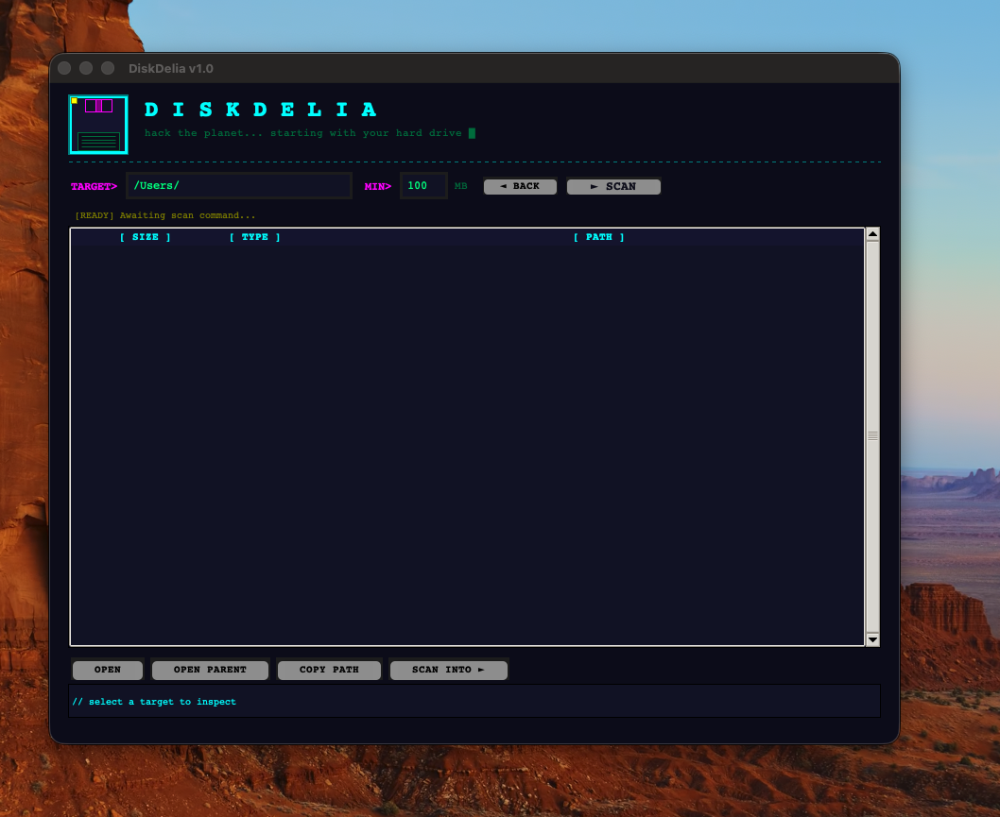

# DiskDelia

**A 90s Cyberdelia-themed macOS storage analyzer.**

*"Hack the Planet... starting with your hard drive."*

DiskDelia helps you find what's eating your disk space — with a special focus on developer bloat like `node_modules`, virtual environments, build caches, and Xcode's infamous `DerivedData`. It comes in two flavors: a retro-styled GUI app and a fast CLI tool.


---



---

## Features

- **Developer-aware scanning** — Automatically identifies 60+ programming-related directories (`node_modules`, `.venv`, `target`, `DerivedData`, `.cargo`, `.conda`, Docker data, and many more)
- **System data probing** — Checks macOS-specific paths like `~/Library/Caches`, iOS backups, Simulator data, and iCloud local storage
- **Large file detection** — Finds files above a configurable size threshold
- **Cleanup hints** — Shows the exact command to clean up each identified item
- **Drill-down navigation** — Double-click any folder to scan deeper into it, with back button history
- **Two interfaces** — GUI (`storage-app.py`) and CLI (`storage-analyzer.py`)

## Quick Start

No dependencies required — both tools use only the Python standard library.

### GUI App

```bash
python3 storage-app.py
```

This launches the full Cyberdelia-themed interface with:
- Configurable scan target directory and minimum size threshold
- Color-coded results (yellow = dev, red = system, blue = large files, green = folders)
- One-click actions: Open, Open Parent, Copy Path, Scan Into
- Real-time scanning status with animated terminal aesthetics

### CLI Tool

```bash
# Scan home directory for items >= 100 MB (default)
python3 storage-analyzer.py

# Scan a specific path with a custom threshold
python3 storage-analyzer.py /path/to/scan 50
```

The CLI outputs a color-coded terminal report grouped into:
1. **Programming / Dev** — safely reviewable for cleanup
2. **Large Files** — individual files above the threshold
3. **Large Folders** — non-programming directories worth investigating

## What It Detects

### Developer Tools & Caches

| Category | Directories |
|---|---|
| **JavaScript** | `node_modules`, `.npm`, `.yarn`, `.pnpm-store`, `.next`, `.nuxt` |
| **Python** | `venv`, `.venv`, `__pycache__`, `.tox`, `.mypy_cache`, `.pytest_cache`, `site-packages`, `.conda`, `anaconda3`, `miniconda3`, `.pyenv` |
| **Rust** | `.cargo`, `target`, `.rustup` |
| **Java/JVM** | `.gradle`, `.m2`, `target` |
| **Ruby** | `.bundle`, `.gem`, `.rbenv` |
| **Go** | `go` (workspace/modules) |
| **iOS/macOS** | `Pods`, `DerivedData`, `.cocoapods`, Xcode Archives, iOS DeviceSupport, CoreSimulator |
| **Other** | `.docker`, `.vagrant`, `.nvm`, `.sdkman`, `.julia`, `.ghcup`, `.stack`, `.opam`, `.pub-cache`, `.flutter` |
| **General** | `build`, `dist`, `vendor`, `.cache`, `.local`, `.Trash` |

### macOS System Paths

- `~/Library/Caches` — Browser, Xcode, Spotify caches
- `~/Library/Application Support` — App data (check for removed apps)
- `~/Library/Developer/Xcode/DerivedData` — Xcode build cache (often 10+ GB)
- `~/Library/Application Support/MobileSync/Backup` — iOS device backups (10-50+ GB)
- `~/Library/Developer/CoreSimulator` — iOS Simulator data
- `~/Library/Mobile Documents` — iCloud Drive local cache
- `~/Library/Mail` — Mail.app local storage
- `~/Library/Messages` — iMessage attachments & history
- And more (system logs, temp files, diagnostic data)

## Building a .app / .dmg

The included `build-dmg.sh` script packages the GUI into a standalone macOS application:

```bash
chmod +x build-dmg.sh
./build-dmg.sh
```

This will:
1. Create a Python virtualenv and install PyInstaller
2. Bundle `storage-app.py` into a `.app` using PyInstaller
3. Package the `.app` into a distributable `.dmg` with an Applications symlink

Output:
- `dist/DiskDelia.app` — The application bundle
- `dist/DiskDelia-1.0.dmg` — The disk image installer

**Requirements for building:** Python 3.11 via pyenv (`~/.pyenv/versions/3.11.8/bin/python3.11`)

## How It Works

1. **Phase 1** — Runs `du -d 3 -k` on the target directory to quickly map disk usage up to 3 levels deep
2. **Phase 2** — In parallel:
   - Probes known macOS system data paths with `du -sk`
   - Runs `find` for individual large files up to 6 levels deep
3. **Classification** — Matches directory names against the known developer tool patterns and tags them by type
4. **Display** — Results are sorted by size (largest first) and color-coded by category

The GUI uses threaded scanning so the interface stays responsive during analysis.

## Tips

- **Start with your home directory** (`~`) and a 100 MB minimum to get a broad overview
- **Drill into large folders** to find what's actually taking space inside them
- **Safe quick wins** that almost always free significant space:
  - `rm -rf node_modules` in old/unused projects
  - Delete `.venv`/`venv` in abandoned Python projects
  - `rm -rf ~/Library/Developer/Xcode/DerivedData` (Xcode rebuilds this as needed)
  - `brew cleanup --prune=all`
  - `docker system prune -a` (if you use Docker)
  - Empty your Trash

## Requirements

- macOS (uses `du`, `find`, and `open` commands)
- Python 3.11+ with tkinter
- No third-party packages needed

## License

MIT
